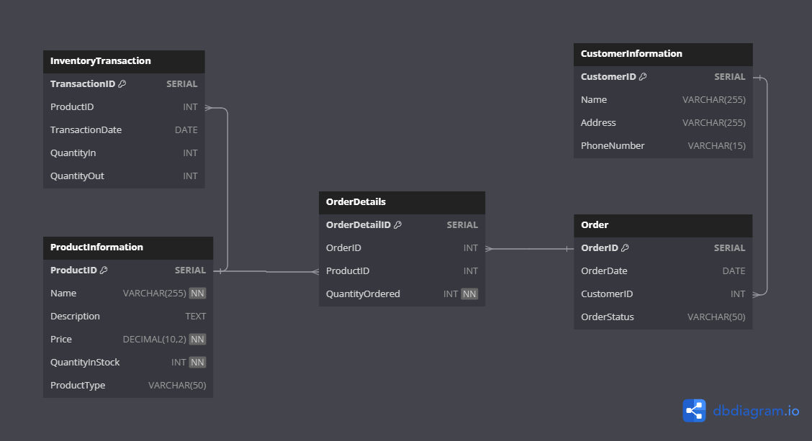

# Take Home Assignment

## Prerequisite Guides

### Activate Virtual Environment
Before starting the assignment, make sure to set up a virtual environment to isolate dependencies. Follow these steps:

1. Open a terminal in the project directory.
2. Run the following command to create a virtual environment:

    ```bash
    python -m venv venv
    ```

3. Activate the virtual environment:

    - On Windows:

        ```bash
        .\venv\Scripts\activate
        ```

    - On macOS/Linux:

        ```bash
        source venv/bin/activate
        ```

### Install Dependencies from `requirements.txt`

1. With the virtual environment activated, run:

    ```bash
    pip install -r requirements.txt
    ```

This will install all the required packages for the assignment.

## Task 1: Python Programming

Navigate to the `task1` folder.

### Running the Task
1. Open a terminal in the `task1` folder.
2. Run the following command to execute the script:

    ```bash
    python task_1.py
    ```

### Sample Data (`data.csv`)
Use the provided `data.csv` file as a sample dataset for testing Feature A. Update the file as needed to cover various scenarios.

## Task 2: Data Structures: E-commerce Inventory Schema

### Database Schema



The database schema for the online store's inventory management system is provided above. Refer to the `task2/task_2.sql` file for the complete SQL code, including table creation, relationships, and constraints.

Additional constraints and configurations are implemented in the SQL file. Refer to comments within the `task_2.sql` file for details on constraints and other considerations.


## Task 3: Web Scraping - batdongsan.com

Navigate to the `task3` folder.

### Running the Task
1. Open a terminal in the `task3` folder.
2. Run the following command to execute the script:

    ```bash
    python task_3.py
    ```

3. **Implementation:**
    - The script checks if the page content is already cached.
    - If cached, the script retrieves the content from the cache file.
    - If not cached, the script uses Selenium to scrape the page, caches the content, and then proceeds.
    - Content includes: `Name, Price, Area, Description, Location`
    - Content is stored in `bat_dong_san.csv`

4. **Caching Details:**
    - Cached files are stored in the `cache_file` directory.
    - Each page's content is cached using a unique filename generated from the MD5 hash of the page URL.

5. **Adjusting Start and End Pages:**
    - You can modify the `START_PAGE` and `END_PAGE` variables in the `run_task_3.py` file to test different page ranges.

## Task 4: Nested Set Model Implementation

Navigate to the `task4` folder.

### Running the Task
1. Open a terminal in the `task4` folder.
2. Run the following command to execute the script:

    ```bash
    python task_4.py
    ```
3. Modify `hierarchical_data` if needed to test for various scenarios

## Task 5: Stored Procedure Creation

Navigate to the `task5` folder.

`task_5.sql`, which contains a PostgreSQL stored procedure to manage blog posts in a relational database.

### Operation Types

The stored procedure supports the following operation types:

- `add_post`: Adds a new blog post.
- `get_post`: Retrieves post details.
- `update_post`: Updates an existing post.
- `delete_post`: Deletes a post.
- `add_comment`: Adds a comment to a post.
- `delete_comment`: Deletes a comment.
- `get_post_data`: Fetches post-related data, including comments.

### Error Handling

The stored procedure includes comprehensive error handling for each operation type. If an invalid operation type is provided or required parameters are missing, the procedure raises an exception to handle such scenarios.